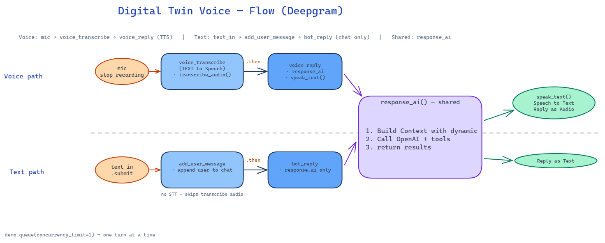

# Digital Twin MultiModal (Voice and Text)

A multimodal digital twin chatbot with **text** and **voice** input, powered by OpenAI (LLM + RAG + tool calling), Deepgram (speech-to-text and text-to-speech), ChromaDB (vector retrieval), and Gradio (web UI).

Converted from the `digital-twin.ipynb` notebook in the AI Engineering course.

## Architecture



**High-level flow:**

1. **Text path** — user types → embed query → ChromaDB retrieval → OpenAI chat (with tools) → reply in chat
2. **Voice path** — user records → Deepgram STT → same RAG + chat pipeline → Deepgram TTS → autoplay reply audio

**RAG pipeline:**

1. Knowledge lives in `knowledge/*.md` (identity, career, technical stack)
2. `chunking.py` splits documents with overlap at sentence/paragraph boundaries
3. OpenAI `text-embedding-3-small` embeds each chunk
4. Vectors are stored in a local ChromaDB collection (`chroma_db_twin/`)
5. Each user message retrieves the top-N similar chunks and injects them as **Context** in the system prompt

**Tools available to the LLM:**

- `send_notification` — Pushover alert to your phone (optional)
- `roll_dice` — simulated dice roll

**Dynamic context:** keywords in the user's message (`2011`, `dishes`, `sports`, `vacation`) inject extra persona context from `knowledge.md`.

## Prerequisites

- Python 3.10+
- API keys:
  - [OpenAI](https://platform.openai.com/api-keys) (required)
  - [Deepgram](https://console.deepgram.com/) (required)
  - [Pushover](https://pushover.net/) (optional, for notification tool)

## Quick start

```bash
# Clone or cd into this directory
cd digital-twin-voice

# Create a virtual environment (recommended)
python -m venv .venv
source .venv/bin/activate   # Windows: .venv\Scripts\activate

# Install dependencies
pip install -r requirements.txt

# Configure environment
cp .env.example .env
# Edit .env and add your API keys

# Build the vector index (also runs automatically on first app launch if empty)
python build_rag_index.py

# Run the app
python app.py
```

Gradio opens at `http://127.0.0.1:7860` (port may vary). Use the text box or microphone to chat.

## Deploy to Hugging Face Spaces

This repo is ready to deploy as a [Gradio Space](https://huggingface.co/docs/hub/spaces-sdks-gradio). The YAML header at the top of this README configures the Space (`sdk: gradio`, `sdk_version: 6.18.0`, `app_file: app.py`).

1. Create a new Space on Hugging Face and choose **Gradio** as the SDK.
2. Push this repository (or connect your GitHub repo).
3. In **Settings → Variables and secrets**, add:
   - `OPENAI_API_KEY` (required — chat + RAG embeddings)
   - `DEEPGRAM_API_KEY` (required for voice input/output)
   - Optional: `PUSHOVER_USER`, `PUSHOVER_TOKEN`, model overrides from `.env.example`
4. On first load, the app builds the ChromaDB index from `knowledge/*.md` (uses OpenAI embeddings). Cold starts on free Spaces may take ~30s.

For faster restarts, enable [Persistent Storage](https://huggingface.co/docs/hub/spaces-storage) and set `CHROMA_PATH=/data/chroma_db_twin`, then run `python build_rag_index.py` once in the Space terminal.

## Project layout

```
digital-twin-voice/
├── app.py              # Entry point
├── build_rag_index.py  # Rebuild ChromaDB from knowledge files
├── chunking.py         # Text chunking with overlap
├── rag.py              # Embeddings, ChromaDB, retrieval
├── config.py           # Environment variables and API clients
├── knowledge/          # Source documents for RAG
│   ├── identity.md
│   ├── career.md
│   └── technical.md
├── knowledge.md        # Keyword topic triggers only
├── prompts.py          # System prompt + topic loading
├── tools.py            # Pushover + dice tools, tool-call handler
├── chat.py             # OpenAI chat loop with RAG + tool calling
├── voice.py            # Deepgram STT / TTS
├── ui.py               # Gradio interface
├── requirements.txt
├── .env.example
└── docs/
    ├── Flow-chart.png
    └── digital-twin-voice-flow.excalidraw
```

## Customization

- **Persona facts:** edit files in `knowledge/`, then run `python build_rag_index.py`
- **Topic keywords:** edit `knowledge.md` under `## Topics`
- **Chunking:** adjust `RAG_CHUNK_SIZE` and `RAG_CHUNK_OVERLAP` in `.env`
- **Retrieval depth:** set `RAG_N_RESULTS` in `.env` (default: 3)
- **Tools:** add functions in `tools.py` and register them in `TOOLS`
- **Models:** set `OPENAI_MODEL`, `EMBEDDING_MODEL`, `DEEPGRAM_STT_MODEL`, and `DEEPGRAM_TTS_MODEL` in `.env`

## Environment variables

| Variable | Required | Description |
|----------|----------|-------------|
| `OPENAI_API_KEY` | Yes | OpenAI API key |
| `DEEPGRAM_API_KEY` | Yes | Deepgram API key |
| `OPENAI_MODEL` | No | Chat model (default: `gpt-4.1-mini`) |
| `EMBEDDING_MODEL` | No | Embedding model (default: `text-embedding-3-small`) |
| `RAG_N_RESULTS` | No | Chunks retrieved per query (default: `3`) |
| `RAG_CHUNK_SIZE` | No | Chunk size in characters (default: `500`) |
| `RAG_CHUNK_OVERLAP` | No | Overlap between chunks (default: `50`) |
| `RAG_DEBUG` | No | Print retrieved chunk sources to console |
| `CHROMA_PATH` | No | ChromaDB directory (default: `chroma_db_twin`) |
| `DEEPGRAM_STT_MODEL` | No | Speech-to-text model (default: `nova-3`) |
| `DEEPGRAM_TTS_MODEL` | No | Text-to-speech model (default: `aura-2-thalia-en`) |
| `PUSHOVER_USER` | No | Pushover user key (for notification tool) |
| `PUSHOVER_TOKEN` | No | Pushover app token (for notification tool) |

## License

Educational project from the AI Engineering course.
